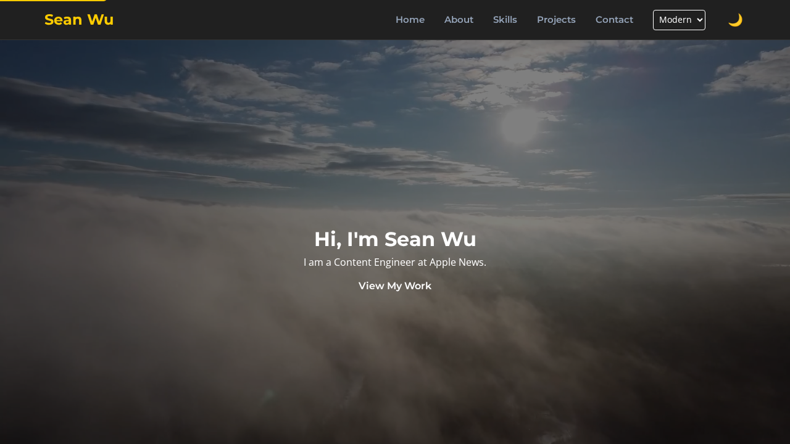

# Sean Wu - Portfolio

A personal portfolio website for Sean Wu, a Content Engineer at Apple News and Software Engineer based in San Francisco. This website showcases my skills, projects, and professional background.



## Features

- **Responsive Design:** The layout adjusts seamlessly to different screen sizes, from desktop to mobile.
- **Dark/Light Mode:** Automatically sets theme based on time of day (light 6AM–6PM, dark otherwise), with a manual toggle to override.
- **Typography Selection:** Users can choose from different typography styles (System, Modern, Classic, Tech).
- **Smooth Scrolling:** Navigation links smooth scroll to the corresponding section.
- **Projects Showcase:** Highlights key projects with links to code repositories.
- **Contact Information:** Provides links to GitHub, LinkedIn, and Email.

## Tech Stack

- **HTML5**
- **CSS3** (CSS Grid, Flexbox, CSS Variables)
- **JavaScript** (ES6+)
- **Font Awesome**
- **Google Fonts**
- **Playwright** (for testing and screenshots)

## Setup and Usage

To run the project locally, you can use `http-server` or any other static file server.

1.  Clone the repository:
    ```bash
    git clone https://github.com/xiaogwu/xiaogwu.github.io.git
    cd xiaogwu.github.io
    ```

2.  Install dependencies:
    ```bash
    npm install
    ```

3.  Start the local server:
    ```bash
    npm start
    ```

4.  Open your browser and navigate to `http://localhost:8080`.

## Testing

The project includes tests using Mocha, Chai, JSDOM, and Playwright.

To run the tests:
```bash
npm test
```

## License

This project is licensed under the MIT License.
